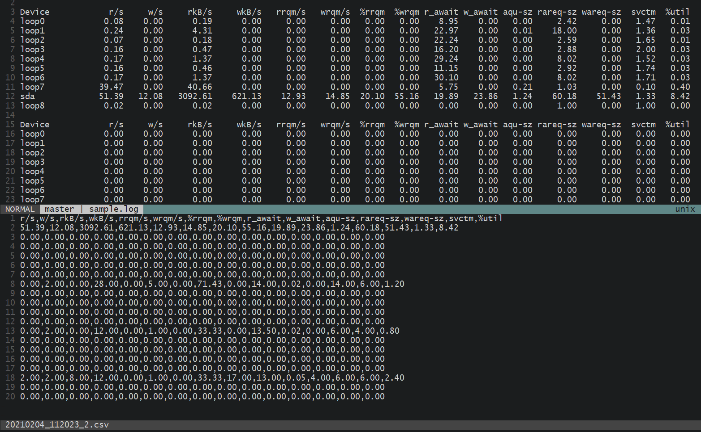

LOG file parser, output as CSV file
===================================



CSV have the advantages of data analysis. 
By using this tool, you can turn LOG file into CSV Table.

## Example

```
$ python log_to_csv.py sample.log
```

And the results will store into **output** folder.

## config.ini

Customize your **searchPatterns**, **targetColumns** and **headers**.

## output/debug.csv

Output of each search pattern's first result. 
Use this result to adjust your targetColumns.

## PlotJuggler

The best visualization tool I've seen so far.

[https://github.com/facontidavide/PlotJuggler](https://github.com/facontidavide/PlotJuggler)

